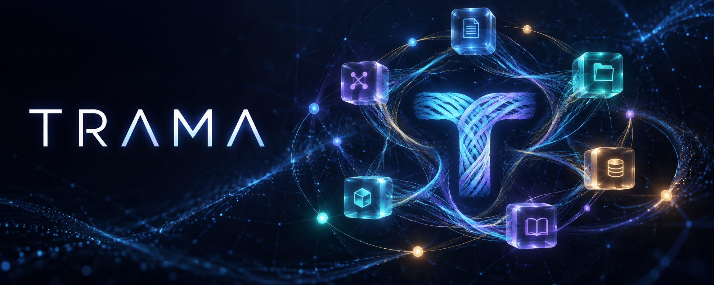
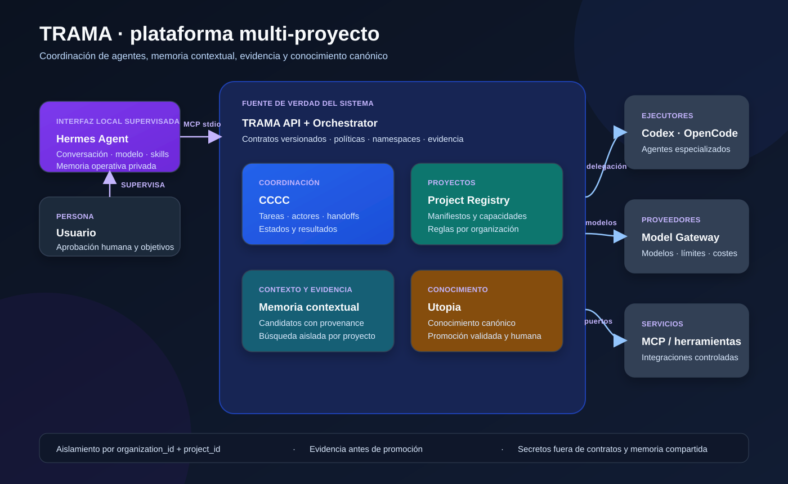

# TRAMA

TRAMA es un entorno independiente para coordinar agentes y conectar varios
proyectos con memoria contextual, conocimiento canónico, herramientas MCP y
proveedores de modelos.

El repositorio no contiene la lógica de los proyectos conectados. Cada proyecto
se registra con un manifiesto y conserva sus propias dependencias, pruebas y
reglas de seguridad.

## Componentes

- **Gateway Go:** admisión durable, idempotencia, cuotas y entrega de eventos.
- **Orquestador TRAMA:** planifica, delega y supervisa.
- **CCCC:** coordina tareas, actores, estados, mensajes y handoffs.
- **Agentes:** Codex, OpenCode y otros ejecutores especializados.
- **Hermes Agent:** interfaz local supervisada conectada mediante MCP `stdio`.
- **Colibri Inference:** proveedor local de modelos para Hermes y agentes Python.
- **Memoria de trabajo del agente:** contexto privado y efímero de cada sesión.
- **Semantica:** memoria contextual y episódica mediante un adaptador externo.
- **Utopia:** conocimiento persistente y canónico mediante un adaptador externo.
- **MCP:** conexión controlada con herramientas y servicios.
- **Model Gateway:** selección de modelos, límites y proveedores.

## Arquitectura de alto nivel



La imagen muestra la frontera principal: Hermes interactúa con TRAMA por MCP,
TRAMA mantiene las políticas y la evidencia, CCCC coordina actores, y los
proyectos conectados conservan su propio código y ciclo de vida.

## Entorno propio

TRAMA utiliza su propio entorno Python. No reutiliza el `.venv` del dashboard.

```powershell
uv venv --python 3.12 .venv
.\.venv\Scripts\python.exe -m pip install -e ".[dev]"
```

Ejecutar pruebas:

```powershell
.\.venv\Scripts\python.exe -m pytest
```

## CLI gateway

El CLI es la interfaz operativa principal de TRAMA. La API local conserva el
estado y la TUI ofrece una vista interactiva de la misma información; no existe
un dashboard web paralelo.

```powershell
trama up
trama status --json
trama doctor --json
trama project list --json
trama task list --json
trama audit list --json
trama tui
```

### TUI TypeScript

Para iniciar la TUI TypeScript, levanta primero la API local y, desde la raíz
del repositorio, ejecuta:

```powershell
.\.venv\Scripts\python.exe -m trama_platform api --host 127.0.0.1 --port 8090
bun install --cwd tui
bun run --cwd tui start
```

La TUI usa `TRAMA_API_URL` para seleccionar la API; si no se define, utiliza
`http://127.0.0.1:8090`. `trama tui` permanece disponible como fallback de la
TUI Python.

El estado del control plane se guarda en `TRAMA_STATE_DIR/trama.db`. `trama
down` solo detiene el proceso API cuyo PID fue registrado por `trama up`.
La coordinación usa memoria local por defecto para pruebas; para despachar
tareas a CCCC, inicia su daemon y activa el backend explícitamente antes de
levantar TRAMA:

```powershell
cccc daemon start
$env:TRAMA_COORDINATION_BACKEND = "cccc"
trama up --json
trama status --json
```

El estado debe mostrar `coordination: CcccCliAdapter`. El backend CCCC usa
`cccc tracked-send` para entregar tareas y `cccc send` para devolver resultados.
Hermes se integra como proceso externo supervisado:

```powershell
trama hermes check --json
trama hermes configure
trama hermes run
```

La TUI de TRAMA opera proyectos, tareas, agentes y evidencia;
la conversación, los modelos, skills y memoria propia de Hermes siguen siendo
responsabilidad de Hermes.

### Observabilidad de planes y tareas

La IA master propone un `PlanProposal` versionado a partir del requisito y su
contexto. Hermes lo presenta para aprobación humana; solo después TRAMA marca
las fases y tareas como disponibles para CCCC. La propuesta, la aprobación, los
handoffs y los resultados quedan unidos por `correlation_id`.

Los cambios de estado se consultan como eventos y los mensajes de ejecución
como logs saneados:

```powershell
Invoke-RestMethod http://127.0.0.1:8090/v1/plans/plan-1
Invoke-RestMethod http://127.0.0.1:8090/v1/tasks/task-1/timeline
Invoke-RestMethod "http://127.0.0.1:8090/v1/logs?project_id=demo&limit=50"
```

Los logs redactan tokens, cookies, claves y credenciales antes de persistirse.
El almacenamiento SQLite permite filtrar por organización, proyecto, requisito,
fase, tarea y nivel, y podar filas antiguas por proyecto. La TUI muestra la
misma información como carriles de fases paralelas, cola de aprobación, cola
CCCC, actividad reciente y timeline de la tarea seleccionada (`Enter`; `Esc`
para volver).

### Planificación por requisitos

Los requisitos se registran desde la TUI o por las herramientas MCP de Hermes.
Hermes propone fases y tareas especializadas; las tareas derivadas quedan en
`planned` hasta recibir aprobación humana. Las fases pueden ejecutarse en
paralelo cuando no tienen `depends_on`; las tareas pueden declarar sus propias
dependencias. La aprobación habilita el despacho a CCCC y la TUI muestra una
vista compacta con barras de progreso por fase, cola CCCC, origen de la tarea,
agente asignado y estados bloqueados/completados.

Iniciar la API local:

```powershell
.\.venv\Scripts\python.exe -m trama_platform api --host 127.0.0.1 --port 8090
```

En otra terminal, desde la raíz del repositorio, iniciar el servidor MCP que
Hermes consumirá:

```powershell
.\.venv\Scripts\python.exe -m trama_platform mcp --api-url http://127.0.0.1:8090
```

En un despliegue distribuido, añade `--gateway-url http://127.0.0.1:8080` (y
`TRAMA_GATEWAY_TOKEN` si el gateway exige autenticación); solo la admisión de
tareas se enruta al gateway Go y el resto de herramientas permanece en Python.

La plantilla [examples/hermes-config.yaml](examples/hermes-config.yaml) se
puede copiar a `%USERPROFILE%\.hermes\config.yaml`. Hermes debe ejecutarse
desde la raíz del repositorio para que `uv` resuelva este proyecto. El perfil
habilita solo las herramientas TRAMA y mantiene las aprobaciones manuales.

También puede iniciarse con Docker:

```powershell
docker compose -f deploy/docker-compose.yml up --build
```

El entorno de gateway distribuido para desarrollo levanta PostgreSQL, NATS
JetStream, Redis, el gateway Go, el outbox y el consumidor Python. El control
plane y los agentes siguen siendo Python; Colibri y Hermes nunca quedan
expuestos por el gateway público:

```powershell
docker compose -f deploy/docker-compose.gateway.yml up --build
```

Si una red corporativa intercepta TLS y Docker muestra `UnknownIssuer`, usar
el modo explícito de contingencia solo en esa red:

```powershell
$env:TRAMA_PIP_INSECURE = "1"
docker compose -f deploy/docker-compose.yml up --build
Remove-Item Env:TRAMA_PIP_INSECURE
```

El valor predeterminado mantiene la validación TLS normal.

El control plane local persiste proyectos, tareas, resultados, candidatos,
promociones y eventos en SQLite. El dispatcher mantiene una cola acotada dentro
del proceso: admite hasta `TRAMA_QUEUE_CAPACITY + TRAMA_MAX_CONCURRENCY` tareas,
ejecuta como máximo `TRAMA_MAX_CONCURRENCY` despachos simultáneos y devuelve
HTTP 429 con código `queue_full` cuando no puede admitir otra tarea. Esta cola
no es un broker compartido entre procesos; configura sus límites con
`TRAMA_QUEUE_CAPACITY`, `TRAMA_MAX_CONCURRENCY` y
`TRAMA_DISPATCH_TIMEOUT_SECONDS`. Los puertos de contexto y conocimiento todavía
usan implementaciones locales por defecto; Semantica y Utopia se conectarán como
adaptadores externos sin convertirlos en dependencias obligatorias de TRAMA.

En el modo distribuido, `POST /v1/tasks` entra al gateway Go con una operación
transaccional de PostgreSQL (admisión, proyección read-your-write y outbox).
El proceso `trama-outbox` publica `task.admitted.v1` en NATS JetStream y
`trama worker` lo consume con un durable y un inbox deduplicado; el `ack` solo
ocurre después de que Python persiste y entrega la tarea a CCCC. Redis comparte
el rate limit entre réplicas. Para producción, configura OIDC/JWKS o una cuenta
de servicio y usa el chart Helm de `deploy/helm/trama-gateway`.

Para conectar servicios HTTP locales o remotos, configura opcionalmente
`TRAMA_SEMANTICA_URL`, `TRAMA_UTOPIA_URL` y `TRAMA_EXTERNAL_TOKEN`. Por ejemplo:

```powershell
$env:TRAMA_SEMANTICA_URL = "http://127.0.0.1:8101"
$env:TRAMA_UTOPIA_URL = "http://127.0.0.1:8102"
$env:TRAMA_EXTERNAL_TOKEN = "token-local"
```

Si las URLs no están definidas, TRAMA conserva las implementaciones locales.
Usa HTTPS para servicios remotos.

## Agentes locales y Colibri

El bridge local de agentes se ejecuta en Python y es el único componente que
inicia Hermes o usa Colibri en el equipo del agente. Colibri se consume como
proveedor OpenAI-compatible local; una instancia atiende una generación a la
vez, por lo que su capacidad se registra como un slot y no se confunde con la
capacidad del gateway. Hermes mantiene el modo interactivo supervisado y el
modo worker requiere activación explícita y sigue respetando aprobaciones
manuales.

El worker Python distribuido se inicia con:

```powershell
trama worker
```

El modo worker local de Hermes continúa siendo opt-in; consumir eventos NATS no
concede por sí solo permiso para ejecutar acciones locales.

El proceso MCP no mantiene estado de negocio propio: reenvía sus operaciones a
la API HTTP local. Reiniciar la API conserva el estado persistido en SQLite.

## Registrar un proyecto

```powershell
.\.venv\Scripts\python.exe -m trama_platform validate-project examples\generador-diccionario.project.yaml
```

El manifiesto de cada proyecto define su repositorio, capacidades, comandos y
políticas. No contiene credenciales.

## Contratos

Los modelos Pydantic de `src/trama_platform/contracts.py` son la fuente de
validación. Los esquemas JSON se pueden exportar con:

```powershell
.\.venv\Scripts\python.exe -m trama_platform export-schemas contracts
```

## Alcance inicial

Esta primera base implementa contratos, namespaces, registro de proyectos,
runtime local, API y adaptador CCCC. Semantica, Utopia, MCP y Model Gateway
quedan desacoplados detrás de puertos explícitos; el puente MCP para Hermes
reenvía las operaciones a la API. Ningún fallo de un adaptador
externo debe impedir que un proyecto ejecute sus pruebas o genere sus propios
artefactos.
