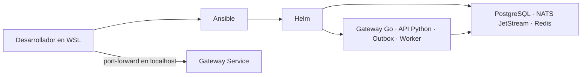

# Diseño: piloto local de Kubernetes para TRAMA

**Fecha:** 2026-09-28
**Estado:** diseño aprobado para revisión de especificación
**Alcance:** despliegue local de desarrollo en Minikube dentro de WSL

## Objetivo

Desplegar el stack distribuido de TRAMA en un clúster local de un nodo usando Ansible para la orquestación y Helm para los releases. El piloto debe reflejar los servicios que hoy se ejecutan con `deploy/docker-compose.gateway.yml`, conservar el estado SQLite usado por la API y el worker, y permitir acceder al gateway únicamente desde el equipo local.

Este piloto valida empaquetado y operación local. No declara que la plataforma esté lista para producción ni que el worker ejecute todo el flujo CCCC de punta a punta.

## Diseño aprobado

- Minikube corre dentro de WSL con un solo nodo. Ansible también se ejecuta desde WSL y verifica que el contexto activo de Kubernetes sea `minikube` antes de aplicar cambios.
- Un namespace `trama` contiene TRAMA y sus dependencias locales.
- Ansible instala PostgreSQL, NATS con JetStream y Redis como releases Helm separados, con versiones y configuración fijadas en el repositorio. PostgreSQL y JetStream conservan sus datos en PVCs; Redis puede usar almacenamiento efímero para este piloto.
- Se amplía el chart existente `deploy/helm/trama-gateway` para incluir el API Python, además del gateway Go, el outbox y el worker Python ya representados.
- Las imágenes de TRAMA se construyen localmente en WSL y se cargan en Minikube. No se requiere un registry externo para el piloto.
- Todos los Deployments de TRAMA usan una réplica fija y el autoscaling queda desactivado. El API y el worker comparten el PVC SQLite existente, igual que en Compose. Los servicios de infraestructura usan sus propios PVCs cuando requieren persistencia.
- Los servicios se comunican por DNS interno de Kubernetes. El gateway se alcanza con `kubectl port-forward` ligado a localhost; no se publica un Ingress ni se expone un servicio a la red local.
- Ansible crea o actualiza los Kubernetes Secrets antes de instalar los charts. Los valores sensibles se guardan en un archivo Ansible Vault fuera del control de versiones, en la configuración del usuario de WSL; los values de Helm solo referencian Secrets.

El flujo operativo queda así:

## Límites y condiciones

La base de datos SQLite y su PVC compartido son válidos únicamente para este clúster local de un nodo y una réplica. No se permite escalar horizontalmente la API o el worker ni programarlos en nodos distintos. Antes de producción, el estado y el inbox de Python deben migrarse a un almacenamiento compartido, preferentemente PostgreSQL, y la estrategia de concurrencia debe quedar definida.

La implementación actual de `serve_task_worker` crea el runtime con `SqliteStateStore` pero no conecta `build_coordination(settings)`; el comando de API sí configura esa coordinación. Por eso el despliegue puede validar salud de pods, conectividad y persistencia, pero no debe presentarse como validación del flujo productivo del worker hacia CCCC. Ese cableado es una condición de salida hacia producción.

Ansible debe fallar si el contexto no es `minikube`, si faltan los secretos requeridos o si las versiones de charts e imágenes no están fijadas. Una actualización normal no elimina PVCs ni el namespace. La eliminación de datos persistidos queda fuera del playbook normal.

## Decisión sobre Harbor, Keycloak y Grafana

| Componente | Decisión para el piloto | Cuándo incorporarlo |
|---|---|---|
| Harbor | No instalar. Las imágenes locales se cargan directamente en Minikube. | Cuando el entorno requiera un registry privado compartido, políticas de acceso o gestión centralizada de artefactos. |
| Keycloak | No instalar. El API queda interno y el acceso local usa el mecanismo de token ya disponible. | Cuando se defina SSO o gestión centralizada de usuarios. El gateway Go ya valida OIDC y claims de organización y scope; el API Python no ofrece hoy ese mismo flujo. |
| Grafana | No instalar. No se encontró instrumentación de métricas Prometheus de la aplicación. | Después de añadir endpoints de métricas y desplegar Prometheus con retención y objetivos de alertas definidos. El metrics-server de Minikube sirve para métricas de recursos/HPA, no sustituye esa instrumentación. |

## Fuera de alcance

- Clúster de producción o de varios nodos, alta disponibilidad, Ingress público, TLS externo y recuperación ante desastres.
- Migración del almacenamiento SQLite de Python a PostgreSQL, o cambios funcionales para completar la coordinación del worker con CCCC.
- Harbor, Keycloak, Prometheus y Grafana en el clúster local.
- Escalado horizontal de API, worker u outbox.
- Cambios de producto, UI o contratos de API.

## Criterios de aceptación

1. Una ejecución documentada de Ansible desde WSL instala o actualiza los releases y puede repetirse sin duplicarlos.
2. Gateway, API Python, outbox y worker quedan listos con una réplica cada uno; PostgreSQL, NATS JetStream y Redis quedan accesibles por Services internos.
3. API y worker montan el mismo PVC SQLite en Minikube; PostgreSQL y JetStream conservan sus datos en PVCs.
4. El único punto de entrada desde el host es el port-forward del gateway ligado a localhost.
5. No hay credenciales en Git ni valores sensibles en los values de Helm; Ansible valida la presencia de Secrets antes del despliegue.
6. La documentación distingue claramente el estado saludable de Kubernetes de la validación funcional del worker→CCCC, que está fuera de este piloto.

## Evidencia del repositorio

El chart actual `deploy/helm/trama-gateway` contiene gateway, outbox y worker, pero no el API Python; espera PostgreSQL, Redis y NATS externos y configura un PVC SQLite para el worker. `deploy/docker-compose.gateway.yml` ejecuta esas dependencias junto con API y worker, compartiendo el volumen SQLite. El almacén de estado de Python implementa SQLite, y el worker no configura actualmente la coordinación que configura el API. El gateway Go ya soporta OIDC. No se encontró una ruta de métricas Prometheus de la aplicación.
